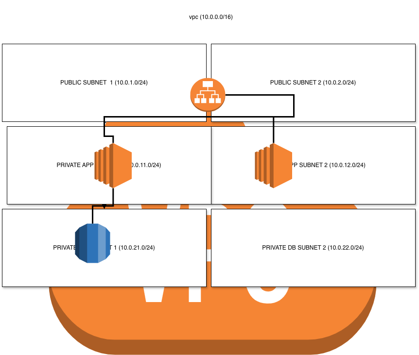

# AWS 3-Tier VPC Architecture with Terraform

## 📌 Architecture Overview
This project provisions a secure, highly available, and scalable 3-Tier AWS VPC Infrastructure using **Terraform**.



## 🏗️ Infrastructure Components
- **VPC**: Classless Inter-Domain Routing (CIDR) `10.0.0.0/16`
- **Public Subnets**: `10.0.1.0/24` & `10.0.2.0/24`
- **Private App Subnets**: `10.0.11.0/24` & `10.0.12.0/24`
- **Private Database Subnets**: `10.0.21.0/24` & `10.0.22.0/24`

## 🚀 How to Deploy
```bash
terraform init
terraform plan
terraform apply
